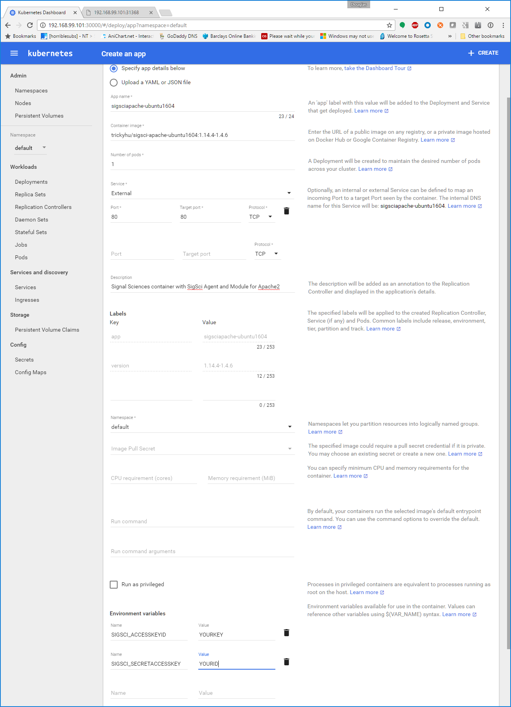

## Signal Sciences Docker Configuration - Ubuntu 16.04

This is a dockerized agent with the SigSci Apache Module and Apache2. This container is set up to take environment variables for the Access Key and Secret Key. You can use a pre-built container or build your own. When building and deploying I tend to use the agent version followed by the SigSci module version for the tag.

## Information about the files

**start.sh**
The start.sh is a simple script for doing some customizations. I use it to start the apache service and then set a custom hostname that the Signal Sciences agent will report up. I like to include a hard coded value, I.E. MYKUBECLUSTERNAME, followed by the dynamically found hostname. On Docker, or Kuberneted, the hostname is the docker id. Between those two things it makes it very easy to figure out where the container is running in relation to the agent found in the Signal Sciences dashboard.

**contrib**
I'll usually create a .dockerignore file that will ignore adding the contrib to the final docker container and put files that I would like to copy into the container in this folder. For example in my demo container I've put a custom splash screen for the default index.html for Apache2. This file gets copied to /var/www/html/index.html.

**sigsci-agent-docker.service**
For people using systemctl, i.e. not Kubernetes, I've made an example service that you can add in. This service will ensure that the docker container automatically comes back up on restart.

**Dockerfile**
The included dockerfile is my example for creating a container that has Apache2, with the SignalSciences Module enabled, and our Signal Sciences Agent.

**Makefile**
I tend to prefer nice easy command for doing my tasks in building, deploying, and testing locally. The makefile simplifies this process but is not necessary.

**Kubernetes-yaml**
Folder containing some exported examples of a Deployment, Service, and Pod.

## Example Deployment creation

## Running the container

`make run DOCKERUSER=trickyhu DOCKERNAME=sigsci-agent-ubuntu1604 DOCKERTAG=1.14.4-1.4.6 SIGSCI_ACCESSKEY=*ACCESSKEY* SIGSCI_SECRETKEY=*SECRETKEY* SIGSCI_RPCADDRESS="unix:/var/run/sigsci/agent" DOCKERMOUNT=/var/run/sigsci/agent`

## Building Docker image

You can use the Makefile to build the Docker Container
Make Example:

`make build DOCKERUSER=YOURDOCUERUSER DOCKERNAME=sigsci-agent-ubuntu1604 DOCKERTAG=1.14.4-1.4.6`

Example:

`make build  DOCKERUSER=MYUSER DOCKERNAME=sigsci-agent-ubuntu1604 DOCKERTAG=1.14.4-1.4.6`

### Deploying to Docker

You can also use the Makefile to deploy the created container to Docker Hub

`make deploy DOCKERUSER=*USERNAME* DOCKERNAME=sigsci-agent-ubuntu1604 DOCKERTAG=1.14.4-1.4.6`

### Exposing Unix Domain Socket

Although the recommended way is to have the agent and module be in the same container, it is possible to separate them. If you do you will also need to share the unix domain socket used for agent communication by starting docker using the -v flag to map /var/run/sigsci to the host OS and other containers. You can't map the sigsci.sock directly to the container as this will map it as a directory instead of a file. Docker currently only allows mapping directories and has no support for files. This means you'll need to tell the modules where to look for the sock file.

Example:

`make run DOCKERUSER=trickyhu DOCKERNAME=sigsci-agent-ubuntu1604 DOCKERTAG=0.1 SIGSCI_ACCESSKEY=*ACCESSKEY* SIGSCI_SECRETKEY=*SECRETKEY* SIGSCI_RPCADDRESS="unix:/var/run/sigsci/" DOCKERMOUNT=/var/run/sigsci`
